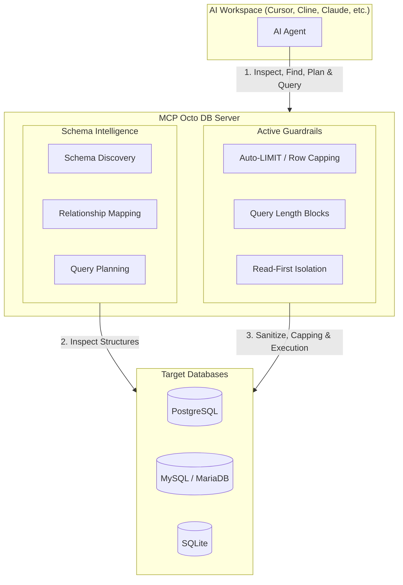

# MCP Octo DB

[](https://github.com/nayosx/mcp-octo-db/actions/workflows/ci.yml)
[](https://github.com/nayosx/mcp-octo-db/actions/workflows/release.yml)
[](https://opensource.org/licenses/MIT)

### Database Intelligence for AI Agents
**Discover schemas, understand relationships, plan queries, and safely access databases.**

> Stop AI agents from guessing your schema. Help them understand your database before they write SQL.

`octo-db` is a **Schema and Database Intelligence Layer for AI Agents**, implemented as a Model Context Protocol (MCP) server. It equips AI agents with the deep relational context, semantic schema intelligence, and active safety guardrails they need to inspect, plan, and query databases.

By separating schema intelligence and discovery from raw SQL query execution, `octo-db` solves the problems of token bloating, unsafe query generation, and schema blindness. It allows LLMs and AI agents (running in clients like Cursor, Cline, Claude Desktop, or Roo Code) to interact with **PostgreSQL, MySQL, MariaDB, and SQLite** databases safely and intelligently.

Current release: `v1.4.5`

---

## In 30 Seconds

| Without Octo DB (Raw SQL MCPs) | With Octo DB (Schema Intelligence) |
| :--- | :--- |
| ❌ **Agents Guess Relationships**<br>Blind, trial-and-error queries lead to syntax and join errors. | ✅ **Relationship Discovery**<br>Agents fetch structural foreign key mappings via [list_relationships](#example-workflows). |
| ❌ **Token-Bloating Schema Exploration**<br>Querying massive system catalogs fills the LLM context. | ✅ **Business-Aware Column Search**<br>Semantic mapping of business terms to fields via [find_columns](#example-workflows). |
| ❌ **Risky SQL Generation**<br>Accidental mutations or table-locking queries run unrestricted. | ✅ **Built-in Safety Guardrails**<br>Enforced query limits, length checks, and read-first isolation. |
| ❌ **Struggle with Legacy Databases**<br>Agents cannot comprehend complex, undocumented schemas. | ✅ **Proactive Query Planning**<br>Pre-verifies queries and joins via [suggest_query_plan](#example-workflows). |

### Key Benefits for Teams & AI Engineers
* 💰 **Reduced Token Costs**: Avoid flooding the context window with bulky catalogs; agents pull only the precise schema nodes they need.
* 🎯 **Better Query Quality**: Eliminate hallucinated joins and incorrect data types by providing the agent with exact foreign-key mappings.
* 🔒 **Safer Database Access**: Block mutating CTEs, prevent DDL changes, and stop unconstrained full table scans.
* ⚡ **Faster Onboarding**: Enable AI agents and developers to explore legacy, undocumented, or massive databases independently in seconds.

---

## Architecture



* **What the Agent sees**: Abstract semantic tools (like `find_columns` and `suggest_query_plan`) that let it query relationships and search concepts in plain language.
* **What Octo DB does**: Acts as a cognitive bridge—mapping semantic terms to schemas, planning joins, validating queries against policies, and automatically injecting safety limits.
* **What reaches the Database**: Only sanitized, read-only, size-capped, and optimized SQL queries—protecting it from locks, loops, and resource exhaustion.

---

## Why Direct Database Access Fails for AI Agents

Simply passing a raw database connection string to an AI agent (e.g., using a traditional SQL command-line wrapper) is a recipe for operational failure. AI agents do not possess the implicit database context and performance constraints that human developers do:

* **Missing Schema Knowledge:** When an agent is dropped into a database blindly, it has no map of the tables. To learn the layout, it must query massive system catalogs (e.g., `information_schema.columns`). This floods the LLM context, leading to **excessive token costs** and slow responses.
* **Missing Relationship Knowledge:** AI agents struggle to identify how tables join. Without explicit integrity paths, they often guess foreign keys, generating syntactically correct but logically broken SQL (e.g., joining tables on mismatched ID fields), yielding wrong metrics.
* **Token Waste:** Without context, agents use brute-force trial and error. They execute broad `SELECT *` queries, fetching millions of rows. This instantly exhausts context windows, breaks the agent's memory, and spikes your API bill.
* **Unsafe Query Generation:** Agents make mistakes. An unconditioned `UPDATE` or `DELETE`, a mutating Common Table Expression (CTE) hidden in a subquery, or a query causing a full table scan can lock databases, crash local services, or delete critical development data.

---

## Why AI Agents Use Octo DB Instead of Direct SQL

Traditional SQL wrappers expose the database directly, forcing the agent to guess the schema. `octo-db` inserts a Schema Intelligence layer that validates, plans, and protects database resources before execution.

```mermaid
graph TD
    subgraph Traditional["Traditional SQL MCP Flow"]
        U1[User Question] --> A1[AI Agent]
        A1 --> SG[SQL Guessing / Trial-and-Error]
        SG -->|Bulky catalog scans or blind queries| DB1[(Raw Database)]
        DB1 -->|Risky lockups or incorrect joins| A1
    end

    subgraph Octo["Octo DB Schema Intelligence Flow"]
        U2[User Question] --> A2[AI Agent]
        A2 -->|1. Business Columns| SD[Schema Discovery via find_columns]
        SD -->|2. Join Verification| RM[Relationship Mapping via list_relationships]
        RM -->|3. Blueprint Plan| QP[Query Planning via suggest_query_plan]
        QP -->|4. Safe execution with Auto-LIMIT| SQ[Safe Query Execution via read_query]
        SQ --> DB2[(Target Database)]
    end
```



---

## Octo DB vs Traditional SQL MCP Servers

Traditional SQL MCP servers act as simple pass-through wrappers that execute whatever SQL the agent sends. `octo-db` acts as an active semantic gateway between the agent and your database:

| Capability / Feature | Traditional SQL MCPs | MCP Octo DB |
| :--- | :---: | :---: |
| **Execute SQL Queries** | ✅ Yes | ✅ Yes (with active validation) |
| **Schema Discovery & Listing** | ❌ Basic list only | ✅ Rich metadata & table search |
| **Relationship Mapping** | ❌ None | ✅ Auto-maps foreign keys (`list_relationships`) |
| **Business Concept Search** | ❌ None | ✅ Semantic match (`find_columns`) |
| **Query Planning** | ❌ None | ✅ Pre-verify queries (`suggest_query_plan`, `explain_query`) |
| **Automatic LIMIT Protection** | ❌ None | ✅ Auto-injects `LIMIT` clauses before execution |
| **Multi-Database Support** | ❌ Single connection | ✅ Maps multiple PG/MySQL/SQLite DBs dynamically |
| **Safety Guardrails** | ❌ None | ✅ Blocks mutations/multi-statements/CTEs by default |

---

## Who Uses Octo DB?

* 🤖 **AI Engineers**: Build database-aware agents that need relational context, semantic column finding, and query planning.
* 💻 **Software Developers**: Onboard coding agents to legacy, massive, or undocumented database schemas to write, explain, and prototype code.
* 🛡️ **Tech Leads & Security Officers**: Guard databases from destructive commands, mutating CTEs, or resource-draining table scans.
* 📊 **Data & BI Teams**: Enable safe, self-serve data analysis where agents translate natural language queries into validated SQL.

---

## Real Problems Octo DB Solves

* **Legacy & Undocumented Databases:** When inheriting a database with hundreds of tables and zero documentation, developers (and agents) get stuck. Octo DB lets agents interactively map table structures, discover primary/foreign key connections via `list_relationships`, and understand the data model in natural language within seconds.
* **Faster Developer & AI Onboarding:** Instead of writing boilerplate queries or manually running CLI commands to explore database shapes, the AI agent uses Octo DB to discover schemas dynamically, getting to productive coding immediately.
* **AI-Assisted Reporting & Query Planning:** Business teams or developers can ask non-technical questions. Octo DB's `suggest_query_plan` tool drafts joining strategies and select filters *conceptually* before executing any SQL.
* **Safer Local Database Access:** AI agents can explore and test against local development environments with robust protection. Lengthy queries are blocked, write commands are rejected by default, and missing limits are automatically injected.
* **Backend Code Generation:** When generating backend structs or models (like Go structs or ORM schemas), the agent uses `describe_table` to retrieve precise column metadata (types, nullability, defaults) and outputs perfectly typed code.
* **Self-Serve Analytics Exploration:** Data analysts or product managers can let an LLM explore safe metrics using `find_columns` (e.g., mapping "revenue" to `order_items.price * order_items.qty`) without risking database locks.

---

## Example: From Question to Query

Here is a step-by-step example showing how an AI agent uses Schema Intelligence to answer a business question: *"How many services were sold this month?"*

```
              User Question: "How many services were sold this month?"
                                    ↓
    [find_columns]          → Agent learns: "services" maps to `order_items.service_id`,
                              "sold" maps to `order_items.quantity`
                                    ↓
    [list_relationships]    → Agent learns: `order_items` joins to `orders` via `order_id`
                                    ↓
    [suggest_query_plan]    → Agent learns: Join `orders` + `order_items`, filter on
                              `orders.created_at`, sum `order_items.quantity`
                                    ↓
    [read_query]            → Agent executes: The planned SELECT statement
                              (with automatic limit safety injection)
                                    ↓
              Answer: "There were 482 services sold this month."
```

### What the Agent Learns at Each Step:

1. **Step 1: Discovering Columns (`find_columns`)**
   * *The Problem:* The agent does not know what table or columns represent "services" or "sold".
   * *The Action:* The agent calls `find_columns(query="service")` and `find_columns(query="sold")`.
   * *The Learning:* It finds that `order_items` contains `service_id` and `quantity` fields. It avoids guessing or querying bulky system catalogs.
2. **Step 2: Mapping Relationships (`list_relationships`)**
   * *The Problem:* The agent needs to join the tables but doesn't know the foreign key relationships.
   * *The Action:* It calls `list_relationships(table_name="order_items")`.
   * *The Learning:* It discovers that `order_items.order_id` links to `orders.id`. Now it knows exactly how to write a valid `JOIN` clause without guessing.
3. **Step 3: Planning the Query (`suggest_query_plan`)**
   * *The Problem:* The agent must structure the date filter and join logic correctly before hitting the database.
   * *The Action:* It calls `suggest_query_plan` with the natural language prompt.
   * *The Learning:* The tool proposes a joining path (`orders` and `order_items`) and a filter (`orders.created_at`). The agent establishes a solid query blueprint.
4. **Step 4: Safe Execution (`read_query`)**
   * *The Problem:* Running a query without constraints could lock database tables or return millions of rows, crashing the client.
   * *The Action:* It calls `read_query` with the generated SQL.
   * *The Learning:* The server validates the SQL, ensures it's read-only, automatically appends a safety `LIMIT 500`, and executes the query. The agent receives the exact count safely.

---

## Example Workflows

The tools exposed by `octo-db` establish a specific querying methodology that AI agents use to operate safely and logically:

* **`find_columns` (Business Concept Search)**
  * *Why it exists:* Maps natural language concepts (e.g. "sales", "date", "created") to real schema fields. It prevents the agent from guessing field names and generating invalid queries.
* **`list_relationships` (Relationship Mapping)**
  * *Why it exists:* Discovers actual database schema constraints and primary/foreign key connections. This eliminates hallucinated joins and lets the agent write accurate `JOIN` statements.
* **`suggest_query_plan` (Query Planning)**
  * *Why it exists:* Instructs the agent to formulate a logical blueprint (candidate tables, joins, and filters) conceptually *before* attempting SQL execution.
* **`read_query` (Safe Query Execution)**
  * *Why it exists:* Executes read-only SQL queries *only* after schema context is established. It enforces length checks, blocks mutating commands, and automatically injects `LIMIT` protections.

---

## Quick Start

### 1. Requirements
* Go 1.22+
* Access to PostgreSQL, MySQL, MariaDB, or SQLite databases.

### 2. Local Postgres Test Environment (Optional)
To spin up a local development database for testing:
```bash
docker compose up -d
```

### 3. Build Octo DB
```bash
git clone <your-repo-url>
cd <your-local-folder>
mkdir -p dist
go build -o dist/octo-db .
```

### 4. Run Interactive Setup (Optional)
To simplify generating your initial local `.env` configuration file, you can run the optional onboarding setup assistant:
```bash
./dist/octo-db setup
```
* **This command is optional.** You remain free to configure everything manually.
* It only generates an initial local `.env` file containing standardized `OCTO_DB_*` environment variables.
* All credentials remain local under your control—**nothing is ever sent to an AI model or transmitted outside your system**.

### 5. Run Connectivity Diagnostics
Run the built-in diagnostic tool to verify database connectivity and check your configuration:
```bash
./octo-db doctor
```

### 6. Verify CLI Operations
```bash
./octo-db --version
./octo-db --list-tools
./octo-db --print-effective-config
```

---

## Configuration Overview

`octo-db` supports configuration through environment variables and a YAML configuration file.

### Environment Variables (.env)
Standard configuration keys use the `OCTO_DB_<ALIAS>_<PROPERTY>` prefix:
* `OCTO_DB_DEFAULT=main`
* `OCTO_DB_MAIN_DRIVER=postgres`
* `OCTO_DB_MAIN_HOST=localhost`
* `OCTO_DB_MAIN_DATABASE=my_database`

For detailed parameter rules, variable namespacing benefits, and YAML-based policy configuration (`config.yaml`), refer to the **[Configuration Guide](./documentation/configuration.md)**.

---

## Deep Technical References & Guides

The detailed technical specifications, security models, and client configuration examples have been separated into dedicated pages to ensure this README remains clear and scannable:

* ⚙️ **[Configuration Guide](./documentation/configuration.md)**: Details environment variables, YAML settings, validation rules, and safe connection patterns.
* 🔌 **[Client Integration Guide](./documentation/client-integration.md)**: Setup guides for Claude Desktop, Cursor, Cline, Roo Code, and Codex. Details wrapper scripts (`run-octo-db.sh` / `.bat`).
* 🔒 **[SQL Safety & Security Guidelines](./documentation/sql-safety.md)**: Full security model, threat model, active guardrails (auto-LIMIT injection, query length blocks), allowed/blocked query patterns, and real-world prompt-to-query workflows.
* 🛠️ **[Developer & Contributor Guide](./documentation/development.md)**: Local development workflows, testing, Makefile commands, Docker integration, release checklists, and distribution details.

---

## License

MIT. See [LICENSE](./LICENSE).
