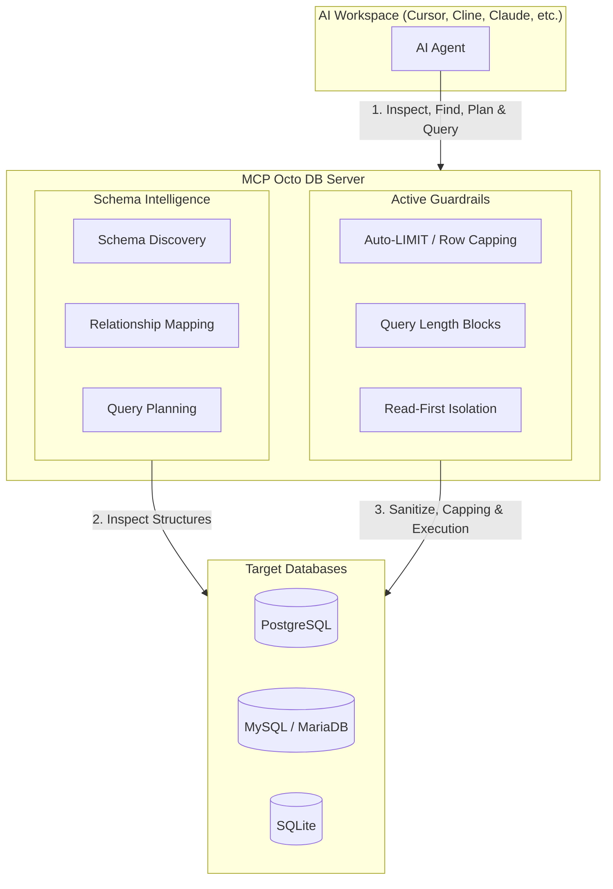

# MCP Octo DB

[](https://github.com/nayosx/mcp-octo-db/actions/workflows/ci.yml)
[](https://github.com/nayosx/mcp-octo-db/actions/workflows/release.yml)
[](https://opensource.org/licenses/MIT)

`octo-db` is a **Schema Intelligence and Database Access Layer for AI Agents**, implemented as a Model Context Protocol (MCP) server. It equips AI agents with the relational context, database discovery capabilities, and active safety guardrails they need to inspect, plan, and query databases. 

By separating schema planning from raw query execution, `octo-db` solves the problems of token bloating, unsafe query generation, and schema blindness. It allows LLMs and AI agents (running in clients like Cursor, Cline, Claude Desktop, or Roo Code) to interact with **PostgreSQL, MySQL, MariaDB, and SQLite** databases safely and intelligently.

Current release: `v1.4.4`

---

## In 30 Seconds

| Without Octo DB (Raw SQL MCPs) | With Octo DB (Schema Intelligence) |
| :--- | :--- |
| ❌ **Agents Guess Relationships**<br>Blind, trial-and-error queries lead to syntax and join errors. | ✅ **Relationship Discovery**<br>Agents fetch structural foreign key mappings via [list_relationships](./tools.go). |
| ❌ **Token-Bloating Schema Exploration**<br>Querying massive system catalogs fills the LLM context. | ✅ **Business-Aware Column Search**<br>Semantic mapping of business terms to fields via [find_columns](./tools.go). |
| ❌ **Risky SQL Generation**<br>Accidental mutations or table-locking queries run unrestricted. | ✅ **Built-in Safety Guardrails**<br>Enforced query limits, length checks, and read-first isolation. |
| ❌ **Struggle with Legacy Databases**<br>Agents cannot comprehend complex, undocumented schemas. | ✅ **Proactive Query Planning**<br>Pre-verifies queries and joins via [suggest_query_plan](./tools.go). |

---

## Architecture



---

## Why Direct Database Access Fails for AI Agents

Simply passing a raw database connection string to an AI agent (e.g., using a traditional SQL command-line wrapper) is a recipe for operational failure. AI agents do not possess the implicit database context and performance constraints that human developers do:

* **Missing Schema Knowledge:** When an agent is dropped into a database blindly, it has no map of the tables. To learn the layout, it must query massive system catalogs (e.g., `information_schema.columns`). This floods the LLM context, leading to **excessive token costs** and slow responses.
* **Missing Relationship Knowledge:** AI agents struggle to identify how tables join. Without explicit integrity paths, they often guess foreign keys, generating syntactically correct but logically broken SQL (e.g., joining tables on mismatched ID fields), yielding wrong metrics.
* **Token Waste:** Without context, agents use brute-force trial and error. They execute broad `SELECT *` queries, fetching millions of rows. This instantly exhausts context windows, breaks the agent's memory, and spikes your API bill.
* **Unsafe Query Generation:** Agents make mistakes. An unconditioned `UPDATE` or `DELETE`, a mutating Common Table Expression (CTE) hidden in a subquery, or a query causing a full table scan can lock databases, crash local services, or delete critical development data.

---

## Octo DB vs Traditional SQL MCP Servers

Traditional SQL MCP servers act as simple pass-through wrappers that execute whatever SQL the agent sends. `octo-db` acts as an active semantic gateway between the agent and your database:

| Capability / Feature | Traditional SQL MCPs | MCP Octo DB |
| :--- | :---: | :---: |
| **Execute SQL Queries** | ✅ Yes | ✅ Yes (with active validation) |
| **Schema Discovery & Listing** | ❌ Basic list only | ✅ Rich metadata & table search |
| **Relationship Mapping** | ❌ None | ✅ Auto-maps foreign keys (`list_relationships`) |
| **Business Concept Search** | ❌ None | ✅ Semantic match (`find_columns`) |
| **Query Planning** | ❌ None | ✅ Pre-verify queries (`suggest_query_plan`, `explain_query`) |
| **Automatic LIMIT Protection** | ❌ None | ✅ Auto-injects `LIMIT` clauses before execution |
| **Multi-Database Support** | ❌ Single connection | ✅ Maps multiple PG/MySQL/SQLite DBs dynamically |
| **Safety Guardrails** | ❌ None | ✅ Blocks mutations/multi-statements/CTEs by default |

---

## Real Problems Octo DB Solves

* **Legacy & Undocumented Databases:** When inheriting a database with hundreds of tables and zero documentation, developers (and agents) get stuck. Octo DB lets agents interactively map table structures, discover primary/foreign key connections via `list_relationships`, and understand the data model in natural language within seconds.
* **Faster Developer & AI Onboarding:** Instead of writing boilerplate queries or manually running CLI commands to explore database shapes, the AI agent uses Octo DB to discover schemas dynamically, getting to productive coding immediately.
* **AI-Assisted Reporting & Query Planning:** Business teams or developers can ask non-technical questions. Octo DB's `suggest_query_plan` tool drafts joining strategies and select filters *conceptually* before executing any SQL.
* **Safer Local Database Access:** AI agents can explore and test against local development environments with robust protection. Lengthy queries are blocked, write commands are rejected by default, and missing limits are automatically injected.
* **Backend Code Generation:** When generating backend structs or models (like Go structs or ORM schemas), the agent uses `describe_table` to retrieve precise column metadata (types, nullability, defaults) and outputs perfectly typed code.
* **Self-Serve Analytics Exploration:** Data analysts or product managers can let an LLM explore safe metrics using `find_columns` (e.g., mapping "revenue" to `order_items.price * order_items.qty`) without risking database locks.

---

## Core Capabilities & MCP Tools

`octo-db` exposes specialized tools designed to feed the LLM exactly what it needs without bloating the context window:

### 1. Schema Exploration Tools
* **`server_info`**: Returns server metadata, active security policies, available databases, and enabled tools.
* **`list_schemas`**: Lists all schemas/databases in the specified database connection.
* **`list_tables` & `list_views`**: Lists tables or views in the specified schema.
* **`search_tables`**: Searches for tables matching a query pattern (e.g. `%users%`).
* **`describe_table`**: Shows structure of a specific table (columns, types, primary keys, nullability, defaults).
* **`list_indexes`**: Lists indexes defined on a table, including uniqueness and columns.

### 2. Schema Intelligence Tools
* **`find_columns`**: Searches for likely columns by business terms (e.g., `service`, `quantity`, `total`, `date`).
* **`list_relationships`**: Exposes foreign-key relationships between tables, showing how to join them.
* **`suggest_query_plan`**: Turns a natural-language question into candidate tables, columns, joins, and filters *without* executing SQL.

### 3. Safe Query Tools
* **`read_query`**: Executes a read-only SQL query (`SELECT`, `SHOW`, `DESCRIBE`, `EXPLAIN`, `WITH`) with active limit and length validation.
* **`explain_query`**: Explains the execution plan of a SELECT query to check indexes and performance.
* **`get_table_sample`**: Gets a small sample of rows (default 10, max 100) to see data formatting.
* **`write_query`**: Executes write operations (disabled by default, active only if `enable_write=true`).

---

## Quick Start

### 1. Requirements
* Go 1.22+
* Access to PostgreSQL, MySQL, MariaDB, or SQLite databases.

### 2. Local Postgres Test Environment (Optional)
To spin up a local development database for testing:
```bash
docker compose up -d
```

### 3. Build Octo DB
```bash
git clone <your-repo-url>
cd <your-local-folder>
mkdir -p dist
go build -o dist/octo-db .
```

### 4. Run Connectivity Diagnostics
Run the built-in diagnostic tool to verify database connectivity and check your configuration:
```bash
./octo-db doctor
```

### 5. Verify CLI Operations
```bash
./octo-db --version
./octo-db --list-tools
./octo-db --print-effective-config
```

---

## Detailed Guides & Reference Manuals

The detailed technical specifications, configurations, and integration guidelines have been separated into dedicated pages to ensure the main landing page remains clear and scannable:

* ⚙️ **[Configuration Guide](./documentation/configuration.md)**: Details environment variables (`OCTO_DB_` prefix advantages), `config.yaml` options, validation rules, and safe configuration patterns.
* 🔌 **[Client Integration Guide](./documentation/client-integration.md)**: Setup guides for Claude Desktop, Cursor, Cline, Roo Code, and Codex. Details the security benefits and setup for **Wrapper Scripts** (`run-octo-db.sh` / `.bat`).
* 🔒 **[SQL Safety & Security Guidelines](./documentation/sql-safety.md)**: Full security model, threat model, active guardrails (auto-LIMIT injection, query length blocks), allowed/blocked query patterns, and real-world prompt-to-query workflows.
* 🛠️ **[Developer & Contributor Guide](./documentation/development.md)**: Local development workflows, testing, Makefile commands, Docker integration, release checklists, and distribution details.

---

## License

MIT. See [LICENSE](./LICENSE).
